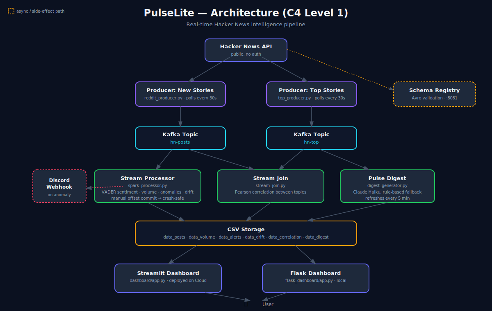
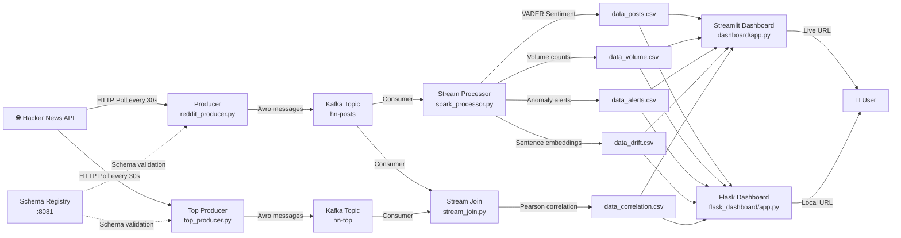

# PulseLite 🔴


🌐 **Live Demo:** https://pulselite-dewesh.streamlit.app *(runs in Demo Mode — see note below)*

> Real-time Hacker News intelligence — sentiment, volume anomalies, cross-topic
> correlation, and topic drift, the moment it happens.

## What it does

PulseLite ingests Hacker News in real time through Kafka and surfaces:

- 🧠 **Pulse Digest** — an LLM-generated (Claude Haiku) narrative summary of what's happening right now, refreshed every 5 minutes, with a deterministic rule-based fallback if no API key is configured
- 📈 **Post volume per minute**, live-updating with a rolling average
- 😊 **Sentiment analysis** (VADER) — positive / negative / neutral, plus a composite mood index
- 🔤 **Trending terms** — most frequent meaningful words across tracked titles
- 🚨 **Anomaly detection** — dual-layer: a 3× rolling-average rule from the stream processor, plus an independent statistical z-score overlay computed in the dashboard, with Discord webhook alerts when a spike fires
- 🔗 **Cross-topic correlation** — a stream-stream join between "new stories" and "top stories" topics, correlating volume with Pearson's r
- 🧭 **Topic drift detection** — sentence-embedding comparison between time windows to catch when the conversation actually shifts topic, not just volume
- 💓 **Pulse Score** — a single 0–100 composite index blending velocity, sentiment, and stability
- ⚙️ **Pipeline health** — schema registry status, table row counts, real Kafka consumer lag, throughput, end-to-end latency, and freshness/liveness badge

## Two dashboards, one pipeline

The Kafka pipeline, stream processor, and all backend logic are shared and
untouched. Only the presentation layer differs:

| | **Streamlit** (`dashboard/`) | **Flask** (`flask_dashboard/`) |
|---|---|---|
| Status | Original build, deployed live | Newer rebuild, same feature set |
| Best for | Quick public demo (hosted, zero setup) | Local walkthroughs, more control over UI |
| Run command | `streamlit run dashboard/app.py` | `python flask_dashboard/app.py` |

Both read from the same CSV files produced by the pipeline, so whichever one
you run, it reflects the same live (or demo) data.

## Architecture



<details>
<summary>Mermaid source (click to expand)</summary>



</details>

Full component-by-component breakdown: [`docs/architecture.md`](docs/architecture.md)

## Tech Stack

| Component | Tool | Why |
|---|---|---|
| Data source | Hacker News API | Free, no auth, real-time |
| Message queue | Apache Kafka (Docker) | Industry-standard decoupled pipeline |
| Serialization | Avro + Confluent Schema Registry | Type-safe messages, backward-compatible schema evolution enforced at deploy time (see [ADR-004](docs/adr/adr-004-schema-registry.md)) |
| Stream processing | Python + confluent-kafka | Sentiment scoring, windowed volume, anomaly detection |
| Sentiment analysis | VADER | Lightweight, no model training needed |
| Drift detection | sentence-transformers | Embedding-based topic shift detection |
| Stream join | Python + NumPy | Cross-topic correlation (see [ADR-005](docs/adr/adr-005-stream-join.md)) |
| Narrative summary | Anthropic API (Claude Haiku) | LLM-generated Pulse Digest, rule-based fallback if no key (see [ADR-006](docs/adr/adr-006-pulse-digest.md)) |
| Storage | CSV | Lock-free handoff between processor and dashboard, no concurrent-writer issues |
| Dashboards | Streamlit + Plotly, and Flask + Plotly | Two front ends over the same backend — see comparison above |
| Alerting | Discord webhooks | Real-time push notification when a volume anomaly fires |
| CI | GitHub Actions | Runs the test suite on every push |
| Code quality | pre-commit (black + ruff) | Consistent formatting and linting on every commit |
| Containers | Docker Compose | Runs Kafka + Zookeeper + Schema Registry without manual install |
| Deployment | Streamlit Cloud | Public demo |

## How to Run Locally

### Prerequisites
- Python 3.11+
- Docker Desktop
- Git

### Install

```powershell
git clone https://github.com/Dewesh10/pulselite.git
cd pulselite
venv\Scripts\activate
pip install -r requirements.txt
```

Copy `.env.example` to `.env` and fill in any optional keys (`ANTHROPIC_API_KEY` for LLM digests, `DISCORD_WEBHOOK_URL` for anomaly alerts) — both are optional; the app falls back gracefully without them.

### Run

```powershell
# 1. Start Kafka + Zookeeper + Schema Registry
docker-compose up -d

# 2. Terminal 1 — new-stories producer
python producer/reddit_producer.py

# 3. Terminal 2 — top-stories producer
python producer/top_producer.py

# 4. Terminal 3 — stream processor (sentiment, volume, anomalies, drift)
python processor/spark_processor.py

# 5. Terminal 4 — stream join (cross-topic correlation)
python processor/stream_join.py

# 6. Terminal 5 — Pulse Digest generator (narrative summary, refreshes every 5 min)
python processor/digest_generator.py

# 7. Terminal 6 — pick a dashboard:

# Streamlit
streamlit run dashboard/app.py

# OR Flask
$env:DEMO_MODE="false"
python flask_dashboard/app.py
```

### Demo Mode (no pipeline required)

Don't want to spin up Kafka just to look around? Both dashboards support a
replay mode using a pre-recorded snapshot — timestamps are shifted to "now"
on every load, so it always looks live even if you run it weeks from now.

```powershell
$env:DEMO_MODE="true"
streamlit run dashboard/app.py
# or
python flask_dashboard/app.py
```

> The hosted Streamlit Cloud demo runs in Demo Mode, since Cloud only hosts
> the dashboard script — it can't run Kafka/producers/processors in the
> background. Run locally with the full pipeline above to see real,
> currently-streaming data on either dashboard.

### Test

```powershell
pip install -r requirements-test.txt
pytest tests/ -v
```

26 tests covering sentiment scoring, anomaly detection boundaries, producer
retry logic, Pulse Digest generation, and Avro schema compatibility (ADR-004).
Runs automatically on every push via GitHub Actions.

## Data Sources

Hacker News public API (`hacker-news.firebaseio.com`) — no authentication
required. Two endpoints are polled every 30 seconds: `newstories.json` and
`topstories.json`, followed by per-item lookups for title, score, and
comment count.

## Pipeline Status

- ✅ Data source — Hacker News API (new stories + top stories)
- ✅ Kafka message queue — Avro-serialized, Schema Registry-validated
- ✅ Stream processor — VADER sentiment, volume, anomaly detection, drift detection, dedup, retry/backoff, graceful shutdown, dead-letter handling
- ✅ Stream-stream join — cross-topic correlation
- ✅ Pulse Digest — LLM-generated narrative summary with rule-based fallback
- ✅ CSV storage — lock-free handoff
- ✅ Streamlit dashboard — 5 tabs (Overview, Live Feed, Trends & Analytics, Anomalies, Pipeline Health) + Demo Mode
- ✅ Flask dashboard — feature parity with Streamlit version, same 5 sections + Demo Mode
- ✅ Pipeline Health — real Kafka consumer lag, throughput, end-to-end latency
- ✅ Discord webhook alerts on anomaly detection
- ✅ CI — automated test suite on every push
- ✅ Pre-commit hooks — black + ruff on every commit

## Architecture Decision Records

- [ADR 001 — Data Source Selection](docs/adr/adr-001-data-source.md)
- [ADR 002 — Message Queue Selection](docs/adr/adr-002-message-queue.md)
- [ADR 003 — Dashboard Framework](docs/adr/adr-003-dashboard.md)
- [ADR 004 — Avro + Confluent Schema Registry](docs/adr/adr-004-schema-registry.md)
- [ADR 005 — Stream-Stream Join](docs/adr/adr-005-stream-join.md)
- [ADR 006 — LLM Pulse Digest](docs/adr/adr-006-pulse-digest.md)

Also see [`docs/design_doc.md`](docs/design_doc.md) for the original problem
statement and [`docs/learning-notes.md`](docs/learning-notes.md) for what
actually broke along the way.

## Mini-Extension

The anomaly detector (3× rolling-average rule) is the required mini-extension
for this problem statement (H3). It's implemented in `check_anomaly()` inside
`processor/spark_processor.py`, and extended beyond the minimum with a
Discord webhook push notification the moment a spike fires — turning a
logged event into something you'd actually notice in real time.

## Known Limitations

- Deduplication is in-memory only — resets on producer restart, so a restart
  can briefly re-send recently seen posts
- The hosted Streamlit Cloud demo sleeps after inactivity (free-tier
  behavior) and shows replayed Demo Mode data, not a live pipeline
- Consumer lag metric requires a locally running Kafka instance — shows
  "N/A" in Demo Mode

## What I'd Do in 3rd Year

See [`roadmap_3rd_year.md`](roadmap_3rd_year.md) for the full extension
plan — moving toward exactly-once semantics, late-arrival handling with
watermarks, a second stream-stream join extension, and eventually migrating
from Kafka Streams-style processing to Flink.

## License & Acknowledgements

Licensed under MIT — see [`LICENSE`](LICENSE). Built as part of the B.Tech
CSE-AIDE Data Engineering internship (Segment 2, Problem H3 — Real-time
Hashtag Pulse).

## Author

Dewesh | B.Tech CSE-AIDE | Internship 2026