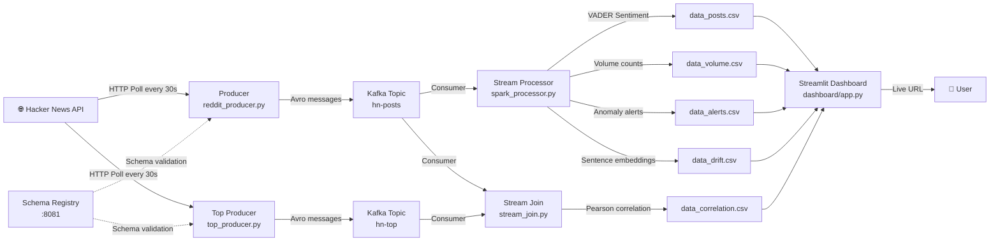

# PulseLite — Architecture

## System Architecture

## Component Details

| Component | Technology | Purpose |
|-----------|------------|---------|
| Data Source | Hacker News API | Real-time tech news posts |
| Message Queue | Apache Kafka (Docker) | Decoupled streaming pipeline |
| Schema Registry | Confluent Schema Registry | Avro schema versioning |
| Serialization | Avro (fastavro) | Type-safe message format |
| Sentiment Analysis | VADER | Post title mood scoring |
| Drift Detection | sentence-transformers | Embedding-based topic shift |
| Stream Join | Python + NumPy | Pearson correlation across topics |
| Storage | CSV files | Lightweight, lock-free storage |
| Dashboard | Streamlit + Plotly | Live intelligence interface |
| CI/CD | GitHub Actions | Automated test suite |
| Deployment | Streamlit Cloud | Public demo URL |

## Data Flow

1. **Ingest** — Two producers poll HN API every 30 seconds
2. **Serialize** — Messages serialized as Avro, validated by Schema Registry
3. **Stream** — Messages flow through Kafka topics hn-posts and hn-top
4. **Process** — Stream processor runs VADER sentiment, computes volume, detects anomalies, computes embeddings
5. **Join** — Stream join correlates volume across two topics using Pearson correlation
6. **Store** — Results written to CSV files (no locking issues)
7. **Visualize** — Dashboard reads CSVs and renders live charts with auto-refresh